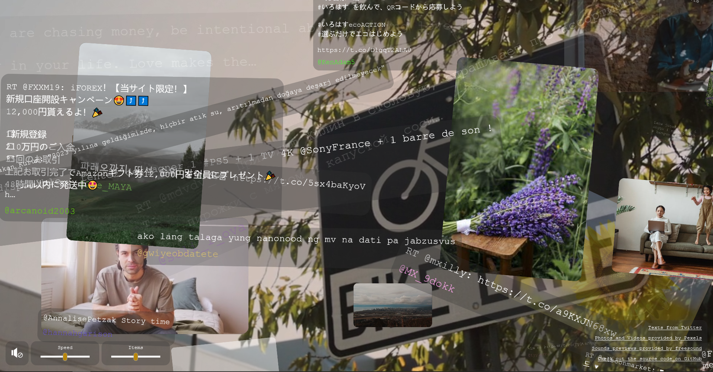

# waytoofast
The purpose of the application is to point out the <strong>information overload</strong> we experience every day.

Check out the app at: [waytoofast.oemel09.de](https://waytoofast.oemel09.de)

This application shows random real-time tweets from [twitter.com](https://twitter.com/)
and random videos and pictures from [pexels.com](https://www.pexels.com/).  
If sound is enabled the app plays random sounds from [freesound.org](https://freesound.org/).

## Screenshot


## API keys
To deploy the application by yourself you need to provide a bearer-token of your twitter developer account
and an API-key for pexels as well as for freesound.
Create a `config.json` file like the `example-config.json` found in this repository.

## Configuration
Configuration is done via the following environment variables:

| Key               	| Default    	| Description                            	    |
|-------------------	|------------	|-------------------------------------------- |
| PORT              	| 61113      	| The port where the app will run        	    |
| PATH_PREFIX       	| -          	| Subdirectory where the app will be deployed |
| TEMPLATES_DIR     	| -          	| Path to the templates directory        	    |
| STATIC_ASSETS_DIR 	| -          	| Path to the static assets (css, js)    	    |
| CONFIG_FILE       	| -          	| Path to the json config file           	    | 

## Build
To build the app run `go install`

## Run
```
TEMPLATES_DIR=/path/to/templates \
STATIC_ASSETS_DIR=/path/to/assets \
CONFIG_FILE/path/to/config.json \
waytoofast
```

### Deploying to a subdirectory
If the app will be available at a subdirectory, set the PATH_PREFIX environment variable
and set the `PATH_PREFIX` constant in the `index.js` file.

## Third party libraries
- [rangetouch](https://github.com/sampotts/rangetouch) to make the sliders work on touch devices
